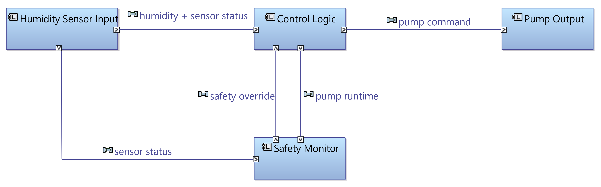

# System Architecture

---

## 1. Overview

The controller is modeled in Capella (Arcadia / MBSE) as four logical components
in a mostly linear flow, with a dedicated **Safety Monitor** separated from the
normal control logic. Isolating safety from nominal behavior is a common practice
in embedded/critical systems: it makes the safety functions explicit and gives them
priority over normal operation.

The architecture is intentionally cleaner than the current implementation (where the
logic lives in a single `irrigation_tick` function): the model shows the intended
structure and separation of concerns.

---

## 2. Architecture diagram (Capella / MBSE)

*Logical architecture — Humidity Sensor Input, Control Logic, Safety Monitor, Pump Output, with the data exchanges between them.*

---

## 3. Components

| Component | Responsibility | Input | Output |
|---|---|---|---|
| **Humidity Sensor Input** | Provide soil humidity and sensor status | sensor readings | humidity, sensor status |
| **Control Logic** | Decide pump on/off from humidity thresholds and hysteresis | humidity, sensor status, safety override | pump command, pump runtime |
| **Safety Monitor** | Enforce safety: sensor fail-safe and max-runtime limit | sensor status, pump runtime | safety override (force pump off) |
| **Pump Output** | Drive the pump | pump command | pump actuation |

---

## 4. Data flow

| From | To | Data | Purpose |
|---|---|---|---|
| Humidity Sensor Input | Control Logic | humidity + sensor status | drive the control decision |
| Control Logic | Pump Output | pump command | activate / deactivate the pump |
| Humidity Sensor Input | Safety Monitor | sensor status | trigger fail-safe on sensor error (REQ-05) |
| Control Logic | Safety Monitor | pump runtime | monitor the max-runtime limit (REQ-06) |
| Safety Monitor | Control Logic | safety override | force pump off when a safety condition is violated |

---

## 5. Why the Safety Monitor is separate

Splitting the **Safety Monitor** from the **Control Logic** reflects two safety
requirements as an independent, higher-priority concern:

- **REQ-05 (fail-safe):** on sensor error, force the pump off.
- **REQ-06 (anti-flooding):** stop the pump once its continuous runtime reaches the
  maximum.

The Safety Monitor does not only observe — it can **act**, forcing the pump off via
the safety override. This makes safety behavior explicit and traceable, rather than
buried inside the nominal control logic.

---

## 6. Requirement ↔ component traceability

| Requirement | Covered by component(s) |
|---|---|
| REQ-01 Safe initial state | Control Logic |
| REQ-02 Activate on low humidity | Control Logic |
| REQ-03 Deactivate on high humidity | Control Logic |
| REQ-04 Hysteresis | Control Logic |
| REQ-05 Sensor fail-safe | Safety Monitor |
| REQ-06 Max-runtime limit | Safety Monitor |
| REQ-07 Threshold invariant | Control Logic (configuration) |
